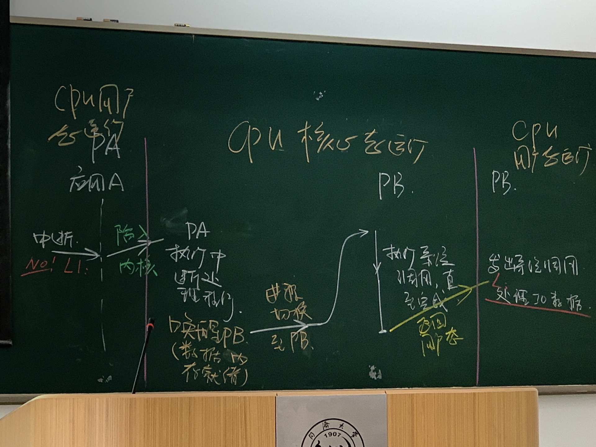
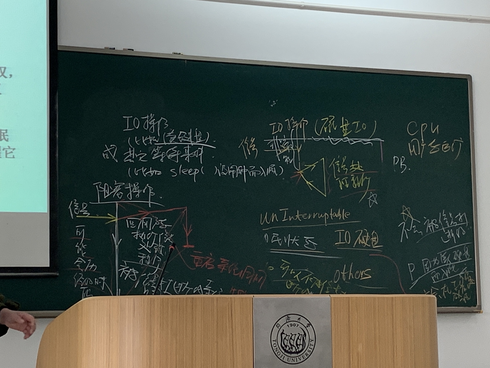
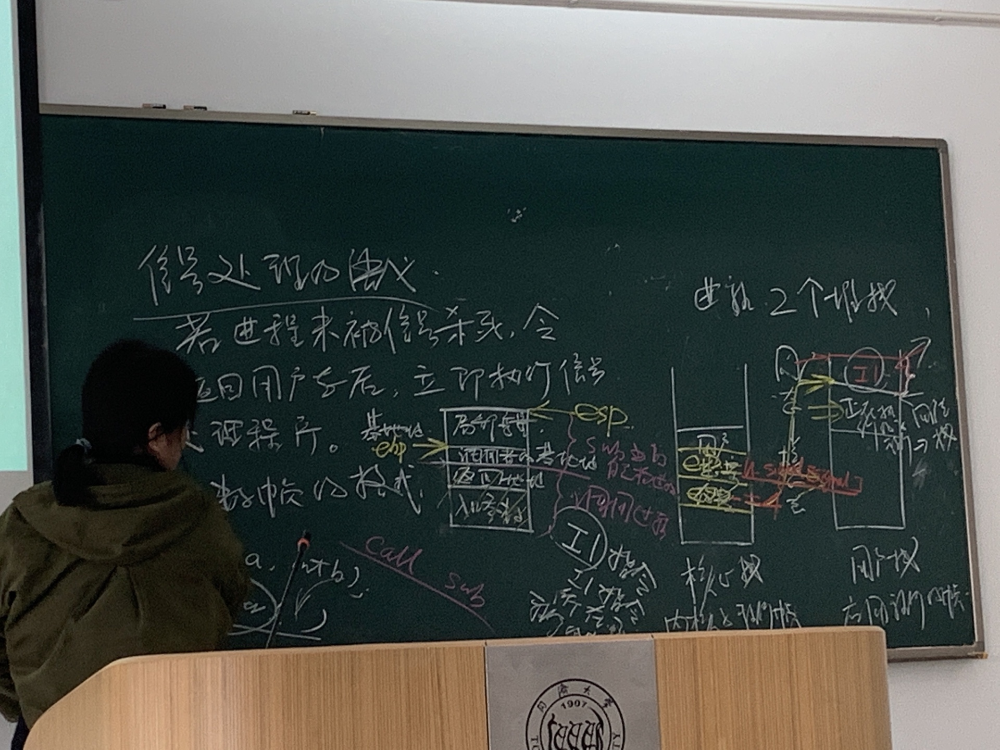
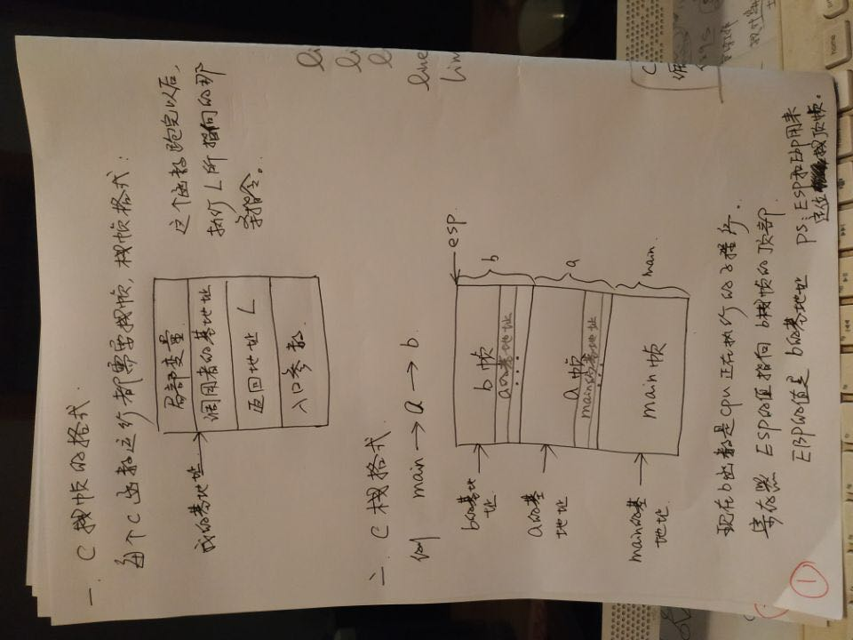
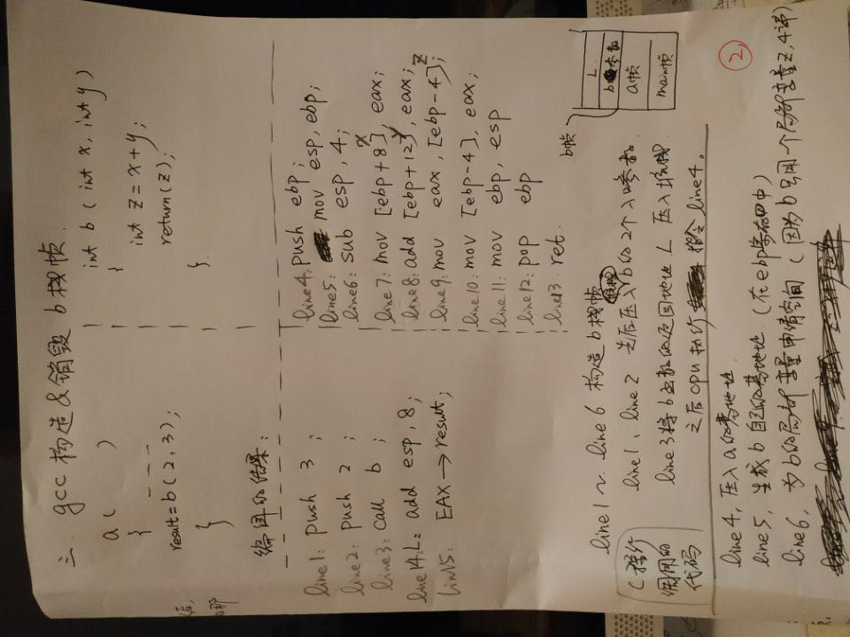
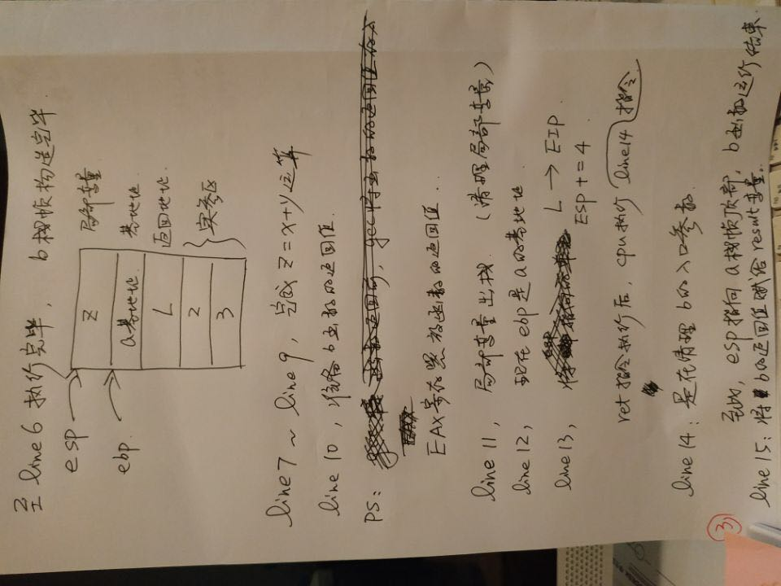
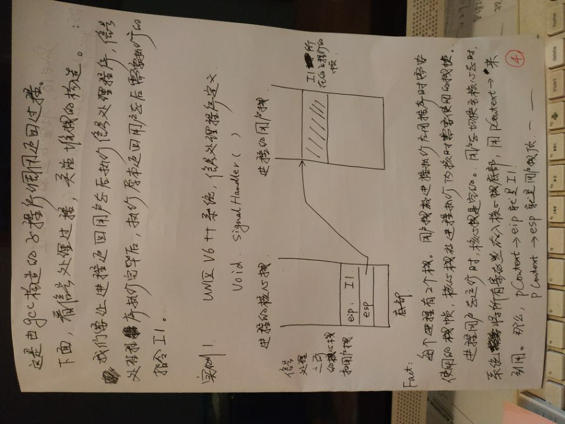
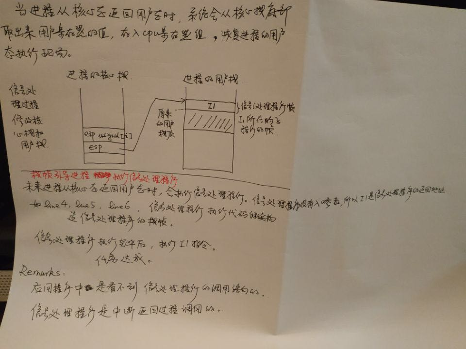

# 绪论

### 地址空间 address space
一个地址空间包含一个app全部data和code：

1. 正文段  包括子程序：代码，不包含库
2. 只读程序段 常量
3. 数据段 全局变量
4. 堆栈帧 包括子程序： n个stack， 保存了局部变量
5. 堆： heap malloc

#### n个stack

a program:

```c
数据段： int a, int b
int main(){

    p1 = pthread(func1, ..)
    p2 = pthread(func2, ..)
    ...
}

```
main: 主线程

main create p1/p2,  n==3

main/p1/p2在同一个地址空间，都可以访问 a, b

栈帧：

main | p1 | p2
---|---|---
..|..|..
..|..|..
main函数帧|func1帧|func2帧

#### Linux中线程就是进程：多好轻量级进程运行在同一个地址空间


### 进程切换

#### 用户态到核心态：

1. 现运行进程执行系统调用: 内核运行进程上下文
2. 现运行执行中断处理程序: 内核运行中断上下文

#### 用户态到核心态

1. 从下一条指令开始
2. 不一定下一条：可能是中断处理唤醒的另一个进程/系统调用的下一条指令



### 内核架构

1. 单内核: 所有模块打包成一个程序
2. 微内核: 一个微内核 + n个模块
3. Linux: 基本模块 + LKM(loadable kernal module): 动态链接， 和基本模块一个程序， 依旧很快

### 文件

一切皆文件

eg. 
. /proc/cpuinfo   

. /proc/[pid]/maps 代码段+数据段+堆+栈  

. /sys/ 外设和总线 ...

## 信号

更高层次异常， 允许内核和进程打断， 定义在user.h

### 数据结构

process[i].p_sig : 收到的信号
user.u_signal[i] : 对i信号的处理方式 0: 系统默认； 1: 忽略； 偶数：处理程序入口地址

### 进程状态

进程不执行系统调用则一定不会入睡

1. 就绪/运行
2. 阻塞/睡眠
   1. 高优先权睡眠： (快系统调用：执行时间段，内核确定可以马上完成)I/O 硬盘， 不会被信号打断，收到信号后一定会在I/O之后再处理信号， 所以又叫不可打断状态 uninterruptable
   2. 低优先权睡眠： (慢系统调用：执行时间可能很长，不受内核控制)其他原因(例如read(#0)), 可以被信号打断， interruptable, 比如sleep()或I/O其他设备文件， 执行完信号处理程序后，被打断的IO/等待操作失败了， 信号处理程序重启原先的系统调用
   3. 原因： 磁盘I/O非常短
   4. 


### 发送

1. 内核直接发送
   1. 程序运行异常，把异常转化为信号
   2. 作业控制： 例如 ctrl+c， SIGINT发送给和这个终端相关的所有进程； Kill 
   3. 读写pipe和socket：写者发现读端关闭，向自己发送一个SIGPIPE信号 （写者不存在的时候， 读者的read -> EOF）

Kill(PID, signal):
   1. PID = 正数， kill(PID, signal), signal 给 pid 指定的 一个进程
   2. PID = 0,  signal 给前台作业（终端上负责执行正在跑的APP的所有进程）的所有进程
   3. PID = 负数， 给|PID|代表的所有进程组 ？？

PSig() 信号处理：
    若进程未被信号杀死，另其返回用户态后，立即执行信号处理程序，信号处理跑完后，再执行APP下一条指令
    linux中 所有进程有两个堆栈：
    1. 核心栈：内核栈帧
    2. 用户栈：应用程序栈帧
    陷入核心态后，核心栈底保存用户栈上下文(eip的值->返回用户态后下一条指令地址, esp的值->用户堆栈栈顶 )用户栈顶保存正在执行的子程序栈帧， 之后进行信号处理
    
    信号处理过程：
        1. 把信号处理的指令push到用户栈顶(esp保存)， eip指向该指令
        2. esp -= 4, 用户栈顶上移， 执行信号处理函数
        3. 把old_eip给新栈帧的返回地址
        4. 处理函数结束后，用户栈弹栈，继续执行原先用户栈的程序



SaveU / aRetU CMU
可靠IO
Introduce to Sys 10.5 10/11章web server  8.5


### 老师提供的Note






