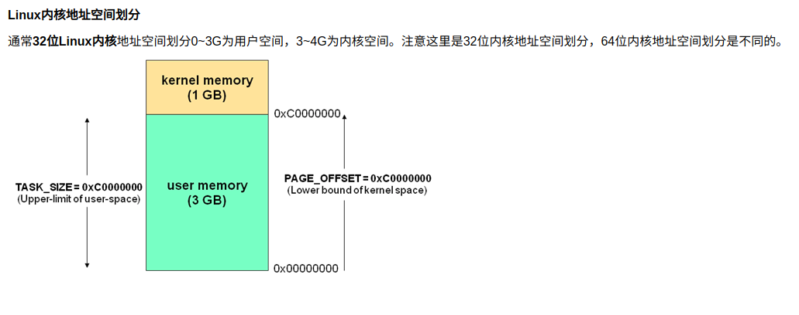
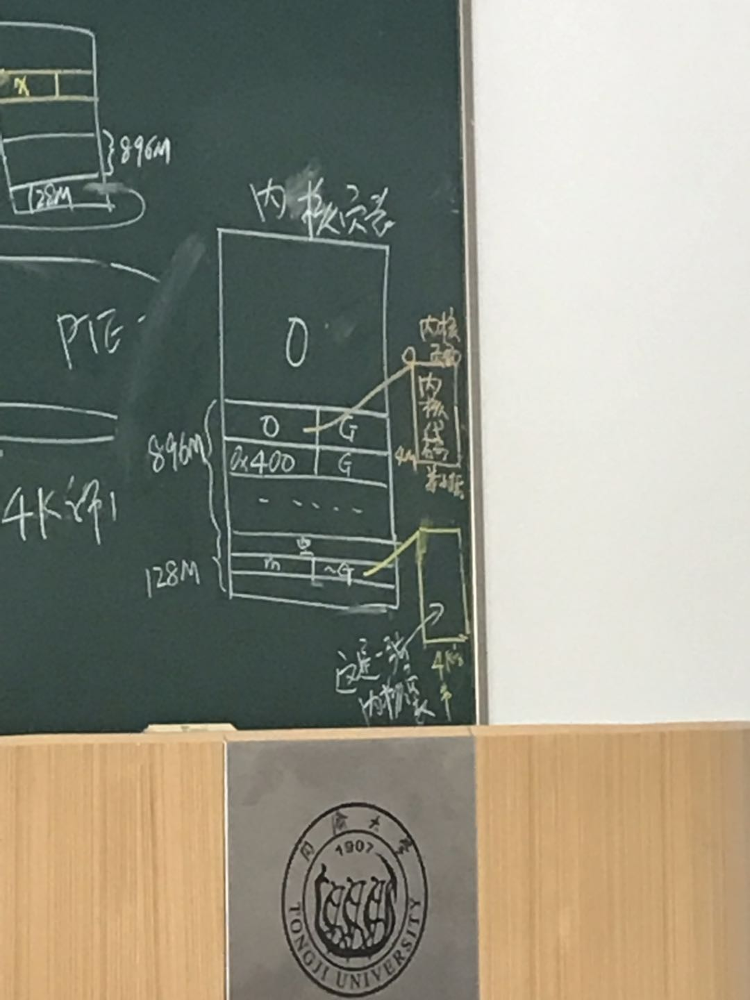

## 两个事实

1. 程序员编码定义了指令和变量， 程序跑的时候CPU最终读写的是L1 Cache里的内容
2. 会用TLB中缓存的PTE进行地址映射（任何使用到的PTE都会过PTE）； 内核和优秀的程序员一定要利用这个事实

## 内核

物理内存：

0-3M|3M-896M|896M->
--|--|--
内核静态部分：代码，全局变量|固定映射：初始空白，映射关系永久确定，但空间free；|动态映射到最后的1/8G虚拟地址空间（内核虚拟地址是从3G到4G，前896M映射物理内存0-896M，后128M映射该部分）

0-896M 页表项对应大小为4M（节约TLB空间）， 其余为4k

下图中的896M是指映射后的大小，不是所有页表项的大小

内核访问动态映射区的主存页框 x
1. 申请一个4K的空间，另起始地址 i*4K， 所以生成一个新的PTE[i]
2. PTE[i].frame = x， 刷新TLB中的PTE
3. x在内核中的地址是i*4k， 填充
4. free i*4K的虚拟空间, 刷新TLB
5. 如果x是APP数据，内核要把x挂在用户空间 p*4k(虚拟空间)， PTE[p], p=引发缺页中断的PTE下标, 当PTE[p] 引发缺页中断时内核把x写入PTE[p].frame，此时执行顺序如下：
   1. PTE[p]引发缺页中断
   2. 内核访问动态映射区的主存页框x，从磁盘调页
   3. 结束后把x写入PTE[p].frame
6. 如果x是页表, 供CPU（中的MMU）使用。

## 页锁定

1. 定义： 必须在内存中， 不能swapout
2. 分配给DMA使用的逻辑页面必须锁定

# 进程

PCB： task_struct

每个进程都有两个堆栈：用户堆栈和核心堆栈（核心态子程序的栈帧，用户态是空的）

CPU的TSS段（每一个CPU有自己的TSS段）， esp0

1. 换核心栈
2. FPU现场切换等杂项
3. 换活动页表（CR3）

PID/TPID

Hello World 逻辑段（共9段，递增）

1. libc: 代码，数据，BSS
2. 代码段，数据段
3. stdio 代码，数据，BSS
4. 堆栈段

Task_struct 中mm_struct的段逻辑链表会组织成红黑树
